Data Scraping on Sports Website
==============================
This is a submission of **assignment 2** for the **CIS711** course.

It contains the code necessary to scrape data from a well-known sports website.

This repository is merely a demonstration of how web scraping performs.

### Refer to [sports-data-visualizer](https://github.com/tariqshaban/sports-data-visualizer) repository to view a [live example](https://tariqshaban.github.io/sports-data-visualizer/).

Getting Started
------------
Clone the project from GitHub

`$ git clone https://github.com/tariqshaban/sports-data-scraper.git`

Install numpy
`pip install numpy`

Install pandas
`pip install pandas`

install matplotlib
`pip install matplotlib`

install seaborn
`pip install seaborn`

Install calplot
`pip install calplot`

install statsmodels
`pip install statsmodels`

Install scipy
`pip install scipy`

Install requests
`pip install requests`

Install beautiful soup
`pip install bs4`

You may need to configure the Python interpreter (depending on the used IDE)

No further configuration is required.

Project Structure
------------
    ├── README.md                 <- The top-level README for developers using this project.
    │
    ├── helpers
    │   ├── date_time_handler     <- Set of static methods that aid some time manipulations.
    │   └── progress_handler      <- Set of static methods that aid some progress manipulations.
    │
    ├── images                    <- Storing readme image files.
    │   
    ├── models
    │   ├── league                <- A container for storing league URL as well as league name.
    │   └── club                  <- A container for storing club id as well as the club name.
    │
    ├── providers
    │   │── hypothesis_container  <-Static methods which perform the hypothesis testing.
    │   ├── plots_provider        <- Static methods which perform the plotting functionality.
    │   └── sports_scraper        <- Static methods which perform the scraping functionality.
    │
    ├── cached_clubs.csv          <- Storing cached clubs from a previous state.
    │   
    ├── cached_matches.csv        <- Storing cached matches from a previous state.
    │   
    ├── cached_players.csv        <- Storing cached players from a previous state.
    │
    └── main                      <- Acts as a sandbox for methods invocation

Report / Findings
------------
### What tools have been used to scrape data off the web?

Beautiful Soup has been used for scraping; it contains abstract out-of-the-box methods that help extract information
from the HTML file.

> Beautiful Soup is a Python library for pulling
> data out of HTML and XML files. It works with your
> favorite parser to provide idiomatic ways of navigating,
> searching, and modifying the parse tree.
> It commonly saves programmers hours or days of work.

There were no modifications committed for this scraping tool since it already satisfies the required objectives.

### What were the target websites?

Primarily [ESPN](https://www.espn.in/)

### Why haven't you used the provided website (CNN Sports)?!

While [CNN Sports](https://edition.cnn.com/sport) is considered an excellent candidate for scraping, it only contains
data about the news itself (Title, images, date of release, content) rather than showing a list of players, etc.

  
Click here to view the full alibi

--------

#### Rejecting CNN Sports

CNN Sports only provide data concerning news; it does not provide any type of semi-structured data in which it can be
capitalized and used to extract the required information.

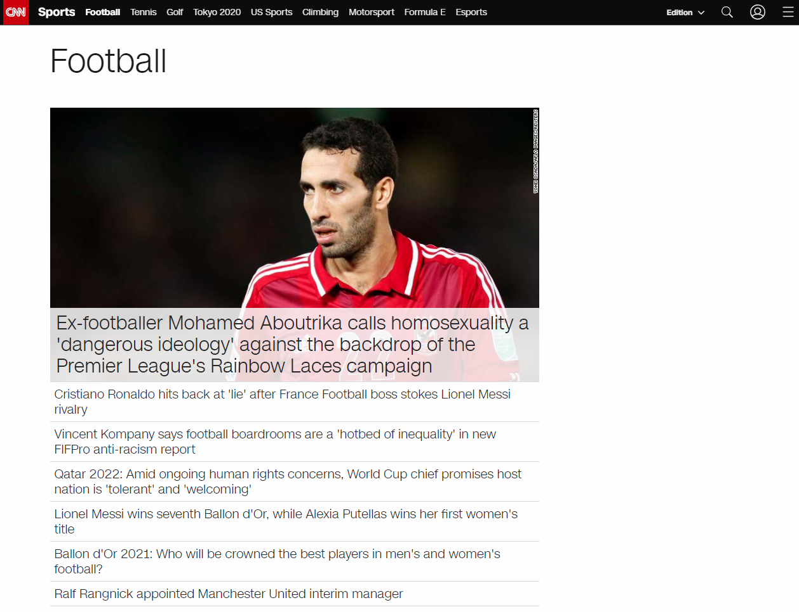

CNN Sports appears to have an RSS (Really Simple Syndication) feed, but it had the same issues as mentioned above.

#### Rejecting BBC Sports

BBC Sports actually contained some highly relevant data; however, the time interval for the data does not even stretch
for more than a month.

Modifying the date manually through the URL did not help.

Also, BBC Sports did not provide a wide collection of leagues; only several leagues were mentioned.

Overall, scraping from BBC Sports will not yield sufficient data for analysis; since the time interval and the number of
leagues are very limited, as well as if did not provide additional data, such as the physical status of the players.

--------

### What information did you extract?

We successfully collected information of the following:

* Players
    * Name
    * Number
    * Position
    * Physical Status
    * Matches Stats (total goals, fouls, etc.)
* Leagues
    * League Name
    * League URL (for future scraping purposes)
* Clubs
    * League Name
    * Club Name
* Matches
    * Elapsed Matches
        * Opponents
        * Result
        * Location
        * Attendance
    * Fixtures
        * Opponents
        * Time
        * TV Channel
        
### What manipulations have you made for the data?

* Players
    * Column datatype conversion
    * Replaced blank spaces/empty values with nulls
    * Replaced double dashes with nulls
    * Converted weight from lbs to kg
    * Converted height from ft to meters
* Leagues
    * None
* Clubs
    * None
* Matches
    * Column datatype conversion
    * Replaced blank spaces/empty values with nulls
    * Replaced double dashes with nulls
    * Dropped rows that contained less than three non-null values

### What is the difference between collecting data via data scraping and using APIs?

Collecting data via **scraping** allows extracting information from web pages, and then manually filtering
the needed information

Collecting data via **APIs** allows direct access to the required data

It is highly recommended to use APIs rather than scraping for the following reasons:
* APIs provide instant data access while scraping requires traversing through multiple webpages
  (which is resource exhausting)
* APIs are much less liable to breaking changes while changing an HTML element class will break the scraping process
* APIs usually include thorough documentation and follows best practices and conventions
* Web scraping might be illegal under certain circumstances
* Most websites try to detect and limit/block web scraping

Use web scraping only when:
* The website does not provide a dedicated API
* The API is either private or requires an access token/key that cannot be acquired
* The data required is not spanned within the API

###  Give an example of using an API

Refer to `__get_clubs()` method within `sports_scrapper.py`, it sends an HTTP GET request to
`http://site.api.espn.com/apis/site/v2/sports/soccer/{league}/teams`,
where {league} is the league codename (for instance `ENG.1`)

### What illustrations have you made?

  
Matches Illustrations

>From `cached_matches.csv` in timestamp `2021-12-11 21:10:31.359935`

> 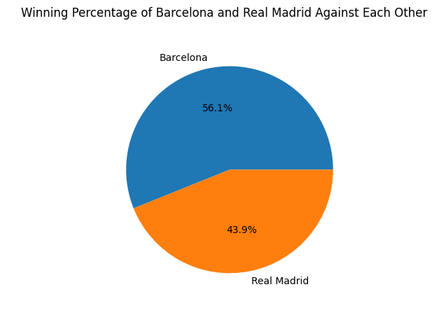
>  
Barcelona had higher win rate than Real Madrid when they went against each other.

> 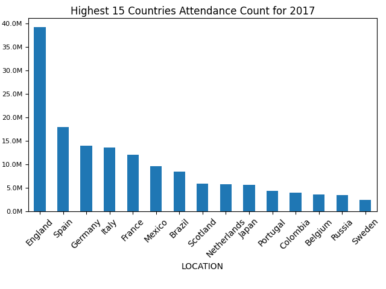
>  
England had the highest attendance during 2017.

> 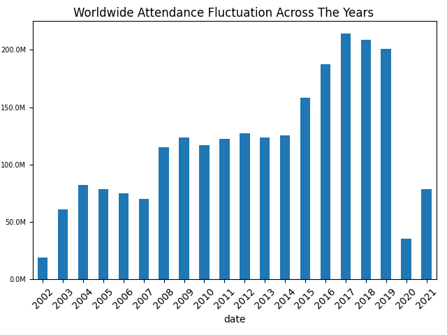
>  
Notice that attendance during 2020 was much less that previous years; this is due to the corona pandemic,
2002 is also less since scraped data started from Oct, 2002.

> 
>  
Notice that matches occur during Saturdays and Sundays, which happens to be the weekend for most of the world .

> 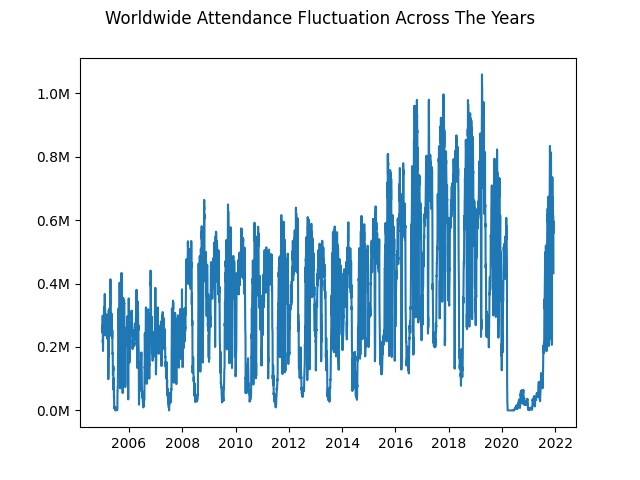
>  
Shows daily attendance fluctuations (in a million), notice the attendance value during 2020 and the beginning of 2021.

 

  
Players Illustrations

>From `cached_players.csv` in timestamp `2021-12-08 09:20:54.785621`

> 
>  
Robert Lewandowski had the highest goals during 2020 (41).

> 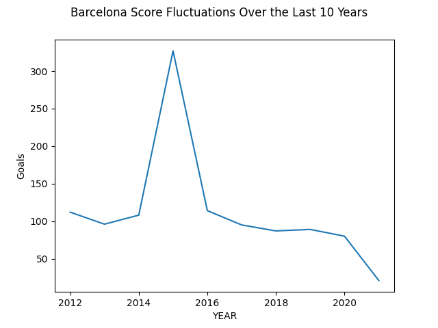
>  
Barcelona peaked during 2015.

> 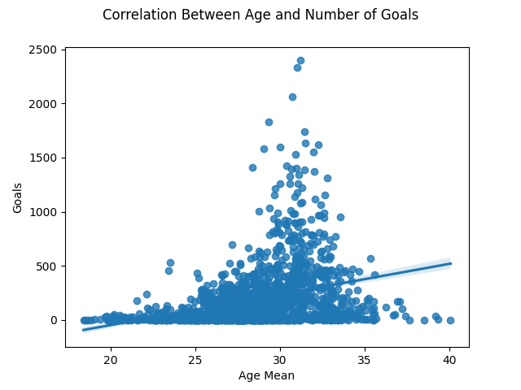
>  
There is a slight correlation between age and the number of goals.

> 
>  
The Spanish LaLiga had the highest yellow cards during 2020, while the French Ligue had the highest red cards.

> 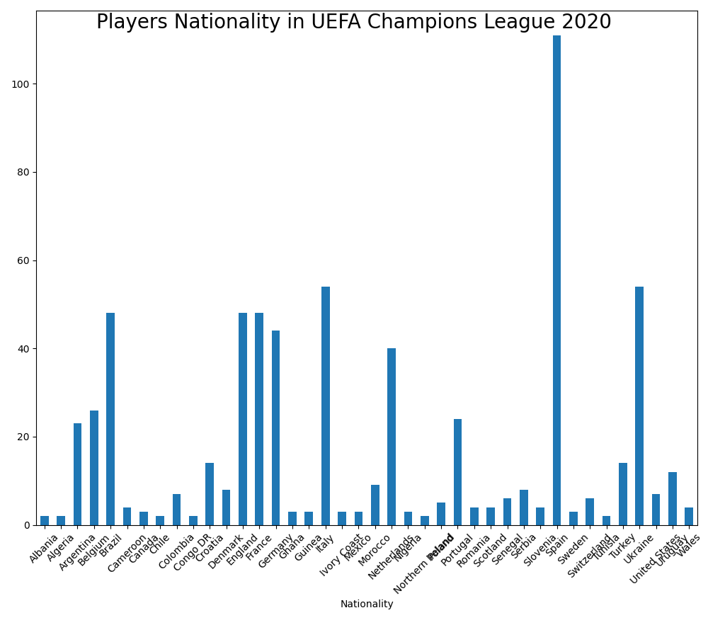
>  
Most players in the UEFA champions league were from Spanish nationality.
 
> 
>  
There is a slight correlation between goals and assists.

> 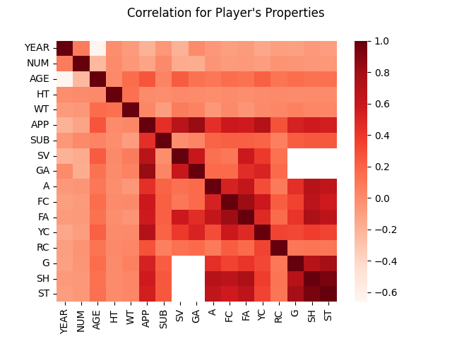
>  
Shows the correlation between all columns in the player's dataframe. The identity is always 1; since it compares itself.

> 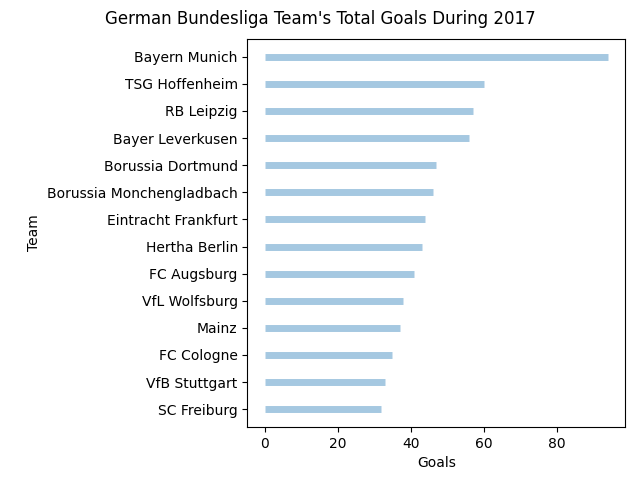
>  
Bayern Munich had the highest goals in the German Bundesliga during 2017.

> 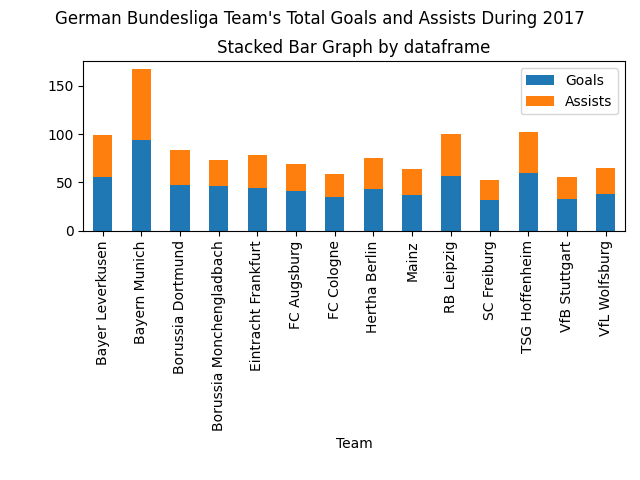
>  
Bayern Munich had also the highest assists in the German Bundesliga during 2017.

> 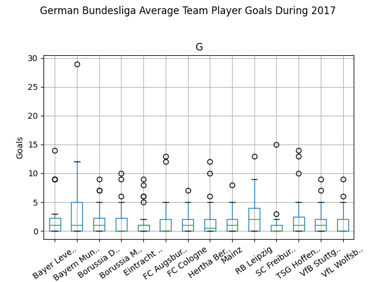
>  
Bayern Munich have a relatively higher Q3 value (denoted by the whisker) in terms of average player goals in the 
German Bundesliga during 2017, this means that we can still (barely) trust having their team an average goals 
score of 12.

### What experiments have you conducted?

The study was:
* Observational: There was no interference
* Retrospective: The data was already available, and the service adds the data in real-time
* Longitudinal: Data might be collected multiple times for the same subject (Player's annual performance)
* Liable to bias: Depending on the data subset, information extracted might be highly biased; due to an event or
inaccuracy. For instance, the pandemic heavily decreased the attendance, data subset must not only span the event's
timeframe
* Blinding: Possible due to inexperience

Refer to ***"plot_comparison_between_attendance_number_over_years"*** plot,
if data was merely collected from 2020, it would have given a false indication that interest in soccer is overall low.

Same as in ***"plot_matches_occurrences_from_2017_to_2020"*** plot, people who
only watch live matches during weekends would have an impression that alot of matches occur each day.

### What hypothesis have you formulated?

  
Matches Hypothesis

>From `cached_matches.csv` in timestamp `2021-12-11 21:10:31.359935`

> 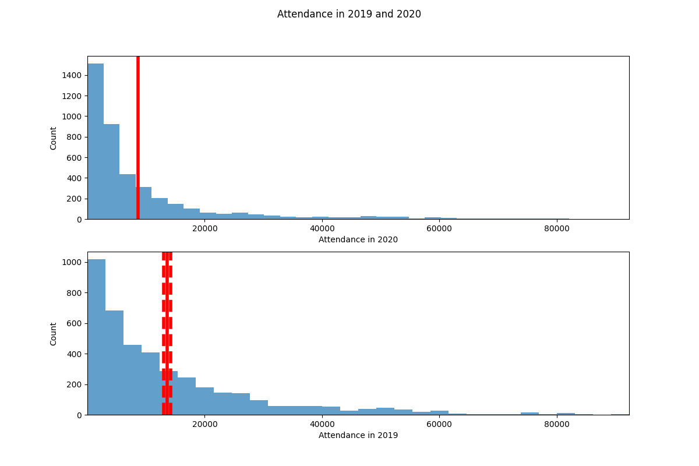
>**Attendance in 2020 was the same as 2019**
>* The difference of the means is 7988.238 person.
>* The P-value is effectively 0, which is smaller than the confidence level of 0.05.
>* The 95% confidence interval of the difference is from 4347.557 to 5516.467, which does not overlap 0.
> 
> 
>Overall, these statistics indicate you <strong>can reject</strong> the null hypothesis (Significantly different).

> 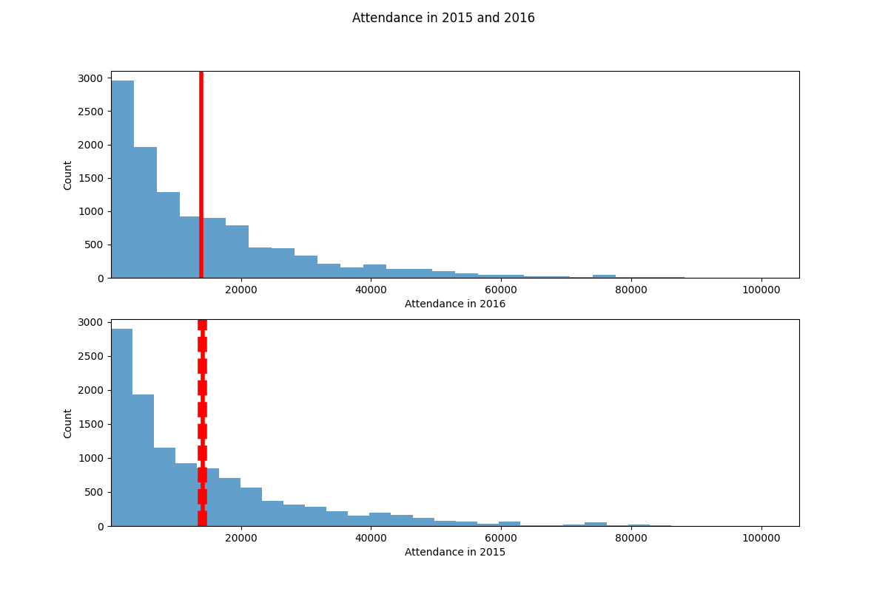
>**Attendance in 2016 was the same as 2015**
>* The difference of the means is 168.579004 person.
>* The P-value is 0.392825, and not effectively 0.
>* The 95% confidence interval of the difference is from -218.820278 to 555.978286, which does overlap 0.
> 
> 
>Overall, these statistics indicate you <strong>can NOT reject</strong> the null hypothesis (Significantly indifferent). 

> 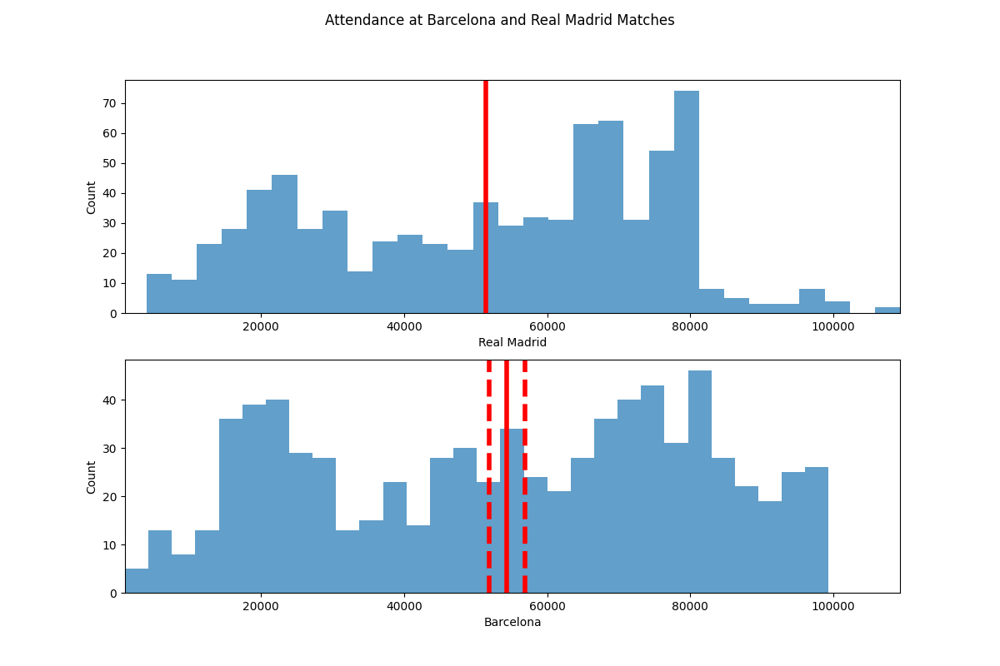
>**Attendance was the same for Barcelona and Real Madrid**
>* The difference of the means is 2937.508974 person.
>* The P-value is effectively 0, which is smaller than the confidence level of 0.05.
>* The 95% confidence interval of the difference is from 444.785042 to 5430.232907, which does not overlap 0.
> 
> 
>Overall, these statistics indicate you <strong>can reject</strong> the null hypothesis (Significantly different).

 

  
Players Hypothesis

>From `cached_players.csv` in timestamp `2021-12-08 09:20:54.785621`

> 
>**Goalkeepers have the same height as other players**
>* The difference of the means is 6.485157 cm.
>* The P-value is effectively 0, which is smaller than the confidence level of 0.05.
>* The 95% confidence interval of the difference is from 6.228166 to 6.742147, which does not overlap 0.
> 
> 
>Overall, these statistics indicate you <strong>can reject</strong> the null hypothesis (Significantly different).

> 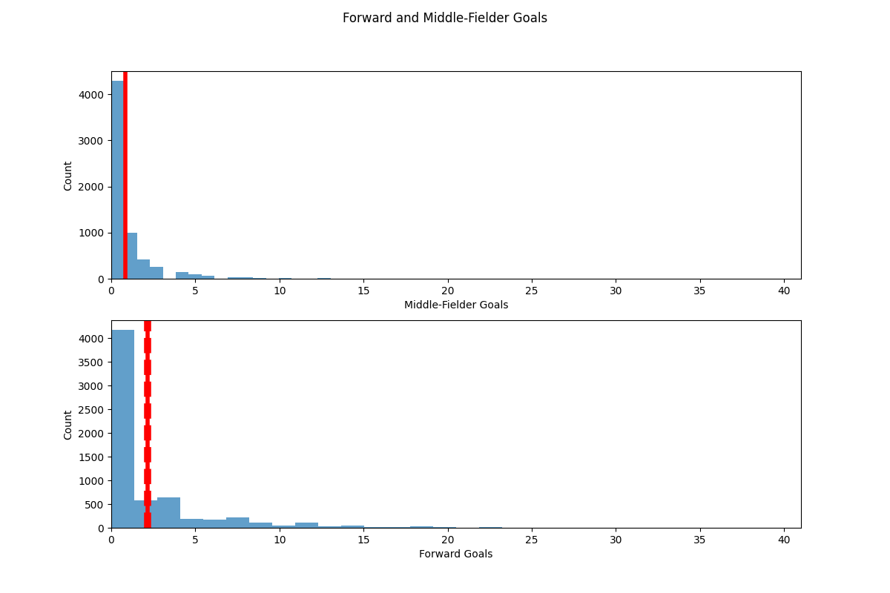
>**Forward and middle-fielders have no difference in goal scoring**
>* The difference of the means is 1.307344 goals.
>* The P-value is effectively 0, which is smaller than the confidence level of 0.05.
>* The 95% confidence interval of the difference is from 1.204559 to 1.410130, which does not overlap 0.
> 
> 
>Overall, these statistics indicate you <strong>can reject</strong> the null hypothesis (Significantly different).

> 
>**Middle-fielders and defenders have the same amount yellow cards**
>* The difference of the means is -0.001883 yellow cards.
>* The P-value is 0.951904, and not effectively 0.
>* The 95% confidence interval of the difference is from -0.065055 to 0.061288, which does overlap 0.
> 
> 
>Overall, these statistics indicate you <strong>can NOT reject</strong> the null hypothesis (Significantly indifferent). 
 

--------